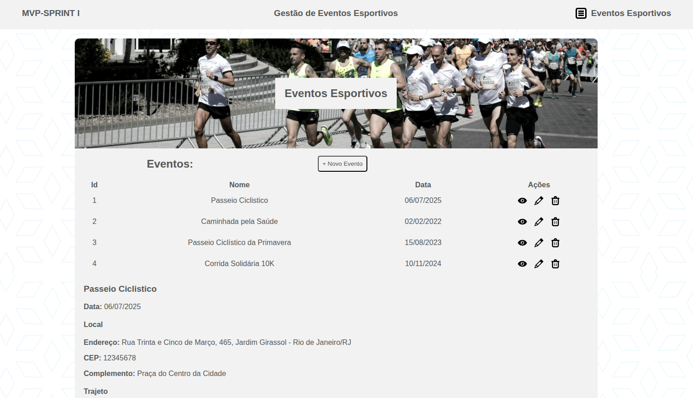

# MPV Sprint 1 - Engenharia de Software/Frontend

Aplicativo para gestão de eventos esportivos.

Este é um projeto frontend desenvolvido com o objetivo de consumir API responsável pela criação, visualização, edição e exclusão de eventos esportivos.

Os eventos podem abranger diferentes modalidades, como caminhadas, passeios ciclísticos, corridas e outras atividades esportivas.

## Integrantes

* **Thiago Pires** - *Desenvolvedor Backend*

## Tecnologias utilizadas:

* HTML;
* CSS;
* Javascript

## Modo de uso:

1. Apenas abrir o arquivo index.html

## Ferramentas utilizadas

* [Visual Studio Code](https://code.visualstudio.com/)
* [Google Chrome](https://www.google.pt/intl/pt-PT/chrome/?brand=CHBD&gclid=Cj0KCQjwn_LrBRD4ARIsAFEQFKt3kLTIsdU6a-sk3FKsxrhplkKaYNHo6Pt3aRbaEAJ3TK4fZslZmtUaAvHVEALw_wcB&gclsrc=aw)

